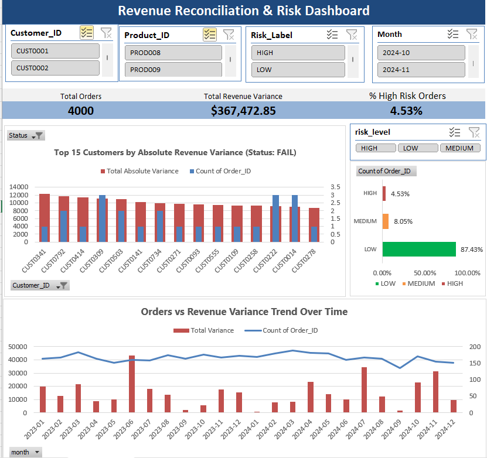

# Excel Order-to-Invoice Reconciliation Dashboard

## Project Overview

This portfolio project demonstrates an end-to-end reconciliation process across orders, invoices, customer contracts, pricing records, and product returns.

The solution identifies missing invoices, quantity discrepancies, pricing mismatches, expired contracts, late returns, over-returns, and material revenue variances. The results are summarized in an interactive Excel dashboard that allows users to review reconciliation status, financial impact, customer trends, and risk levels.

This project uses synthetic data created solely for demonstration and portfolio purposes.

## Business Problem

Organizations frequently store order, invoice, pricing, contract, and return information in separate systems. Differences across these sources can cause:

- Revenue leakage
- Incorrect customer billing
- Missed invoices
- Contract pricing errors
- Unresolved return discrepancies
- Inaccurate financial reporting

The objective of this project was to create a repeatable reconciliation process that identifies these discrepancies and presents actionable information to business users.

## Tools and Technologies

- Microsoft Excel
- Power Query
- PivotTables and PivotCharts
- Excel formulas
- Slicers and dynamic dashboard titles
- SAS
- PROC SQL
- SAS macros and data validation techniques

## Data Sources

The synthetic project data includes:

- 800 customers
- 300 products
- 500 contracts
- 4,000 orders
- 4,092 invoice records, including duplicates
- 400 return records
- 900 price-master records

## Project Workflow

1. Imported order, invoice, return, contract, customer, product, and pricing data.
2. Reviewed data types, missing values, duplicates, and key-field quality.
3. Removed or consolidated duplicate invoice records.
4. Joined orders to invoices using a left join.
5. Aggregated returns before joining them to transaction data.
6. Joined applicable contracts and price-master records.
7. Calculated expected and invoiced revenue.
8. Created reconciliation flags and severity scores.
9. Assigned PASS or FAIL status.
10. Built PivotTables, KPI cards, charts, and slicers.
11. Validated record counts, calculations, and reconciliation rules.

## Reconciliation Controls

The project evaluates the following conditions:

- Missing invoice
- Unit mismatch
- List-price mismatch
- Contract-price mismatch
- Expired contract
- Late return
- Over-return
- Material revenue variance

## Dashboard Features

The dashboard includes:

- Total orders reviewed
- PASS and FAIL counts
- PASS rate
- Total absolute revenue variance
- High-risk order percentage
- Risk-level distribution
- Monthly reconciliation trend
- Top customers by absolute variance
- Interactive Status, Risk Level, Month, Customer, and Product filters

## Risk Scoring

A weighted severity score prioritizes records based on the type and financial significance of each discrepancy.

Higher weights are assigned to issues such as missing invoices, pricing mismatches, expired contracts, and material revenue variances. Records are then categorized as Low, Medium, or High risk.

## Key Findings

The dashboard can be used to identify:

- Customers responsible for the greatest absolute variance
- Months with elevated reconciliation failures
- Orders with multiple simultaneous control failures
- High-risk records requiring immediate investigation
- Pricing and contract issues with potential financial impact
- Return patterns that may indicate process weaknesses

Because this project uses synthetic data, findings demonstrate analytical functionality rather than actual company performance.

## Dashboard Preview



## Repository Structure

```text
data/             Synthetic input data and data dictionary
excel/            Final Excel reconciliation workbook
sas/              SAS data preparation and reconciliation programs
documentation/    Business rules, workflow, and validation documentation
images/           Dashboard screenshots
